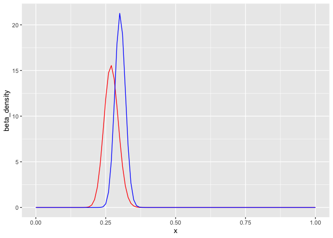

Empirical Bayes
================
Arvind Venkatadri
25/06/2019

Following David Robinson’s book “Empirical Bayesian Estimation”. Also
will peep into **Facebook Prophet** and **Google CausalImpact**.

Empirical Bayes is an approximation to more exact Bayesian methods -
where a beta distribution is fitted on all available observations and is
then used to improve each individually. What’s great about this method
is that as long as you have a lot of examples, you don’t need to bring
in prior expectations.

## The Beta Distribution

In Bayesian estimation, we have a `prior` probability of an event, which
is updated when a new data point arrives. This updated probability
distribution, `posterior` becomes the prior for the next interation
using the next data point.

The **beta distribution** is a good choice for Bayesian priors:  
\- domain is \[0,1\]. The beta distribution represents a probability
distribution of probabilities.  
\- Bayesian update to posteriors is very easy

\[
p_{beta}(x) = \frac{x^{\alpha-1} \cdot (1-x)^{\beta-1}}{B(\alpha,\beta)}
\\\\
where\ x [0,1]
\\\\
E[X] = \frac{\alpha}{\alpha + \beta}
\]

``` r
betaplot <- function (alpha, beta) {
# params <- tribble( ~ alpha, ~ beta,
#   1, 2,
#   3, 3,
#   20, 20,
#   50, 10)
curve <- map2(alpha, beta, dbeta, x = seq(0, 1, 0.01))
curve <- 
  tibble(x = 
      seq(0, 1, 0.01),
    beta_density = curve[[1]])
}

gf_line(beta_density ~ x, data = betaplot(1,2), color = "green",title = "Beta Distribution Curves",
  xlab = "Batting Average",
  ylab = "Density of Beta") %>%
  gf_line(beta_density ~ x, data = betaplot(3,3), color = "red") %>%
  gf_line(beta_density ~ x, data = betaplot(20,20), color = "blue") %>%
  gf_line(beta_density ~ x, data = betaplot(50,10), color = "salmon") %>% 
  # Adding Text Labels
  gf_label(2~0.05, label = "alpha = 1, beta =2") # Needs more work
```

<!-- -->

## Batting Averages

In using *Empirical Bayesian Estimation*, we use the available data on
Baseball batting averages to estimate what could be future batting
averages based on new events.

Baseball stuff:  
H: Hits  
AB : “At Bats” ( like an innings in cricket. Maybe)  
Batting Average = H/AB

> A player’s batting average is therefore a percentage between 0 and 1.
> .270 (27%) is considered a typical batting average, while .300 (30%)
> is considered an excellent one.

We have `prior expectations` of players and do not rely on the first few
“At Bats” to foretell what average a player may attain.

The number of hits a player gets out of his “at bats” is a `binomial`
distribution, which models successes out of a total.

``` r
# Preparing `Batting Average` data frame

career <- 
  Batting %>% 
  filter(AB > 0) %>%   # At least one `at bat`
  anti_join(Pitching, by = "playerID") %>%  
# leave out the pitchers because they usually are poor batters. 
# No `all-rounders` in baseball! Ha!
  group_by(playerID) %>% 
  summarise(H = sum(H), AB = sum(AB)) %>% 
  mutate(average = H/AB)


# Add Player names please
career <- Master %>% 
  as_tibble() %>% 
  dplyr::select(playerID, nameFirst, nameLast) %>% 
  unite(name, nameFirst, nameLast, sep = " ") %>% 
  inner_join(career, by = "playerID") %>% 
  dplyr::select(-playerID)
career
```

    ## # A tibble: 9,670 x 4
    ##    name                  H    AB average
    ##    <chr>             <int> <int>   <dbl>
    ##  1 Hank Aaron         3771 12364  0.305 
    ##  2 Tommie Aaron        216   944  0.229 
    ##  3 Andy Abad             2    21  0.0952
    ##  4 John Abadie          11    49  0.224 
    ##  5 Ed Abbaticchio      772  3044  0.254 
    ##  6 Fred Abbott         107   513  0.209 
    ##  7 Jeff Abbott         157   596  0.263 
    ##  8 Kurt Abbott         523  2044  0.256 
    ##  9 Ody Abbott           13    70  0.186 
    ## 10 Frank Abercrombie     0     4  0     
    ## # … with 9,660 more rows

``` r
career %>% 
  filter(AB >= 500) %>% 
  gf_histogram(~average,data = .,bins = 50, title = "Scores of Batters with AB > 500") %>% 
  gf_vline(xintercept = ~mean(average), color = "red")
```

<!-- -->

> Empirical Bayes is an approximation to more exact Bayesian methods-
> and with the amount of data we have, it’s a very good approximation.
> So far, a beta distribution looks like a pretty appropriate choice
> based on the above histogram. So we know we want to fit the following
> model:

> X ∼ Beta(α0,β0)

> We just need to pick α0 and β0, which we call “**hyper-parameters**”
> of our model.We can fit these using **maximum likelihood** : to see
> what parameters would maximize the probability of generating the
> distribu- tion we see.

> There are many functions in R for fitting a probability distribution
> to data (`optim`, `mle`, `bbmle`, etc). You don’t even have to use
> maximum likelihood: you could use the mean and variance, called the
> [“method of
> moments”](https://stats.stackexchange.com/questions/12232/calculating-the-parameters-of-a-beta-distribution-using-the-mean-and-variance).
> We’ll choose to use the `mle` function, and to use dbetabinom.ab.

``` r
#library(stats4)
career_filtered <- 
  career %>% 
  filter(AB > 500)
career_filtered
```

    ## # A tibble: 4,209 x 4
    ##    name                H    AB average
    ##    <chr>           <int> <int>   <dbl>
    ##  1 Hank Aaron       3771 12364   0.305
    ##  2 Tommie Aaron      216   944   0.229
    ##  3 Ed Abbaticchio    772  3044   0.254
    ##  4 Fred Abbott       107   513   0.209
    ##  5 Jeff Abbott       157   596   0.263
    ##  6 Kurt Abbott       523  2044   0.256
    ##  7 Brent Abernathy   212   868   0.244
    ##  8 Shawn Abner       191   840   0.227
    ##  9 Cal Abrams        433  1611   0.269
    ## 10 Bobby Abreu      2470  8480   0.291
    ## # … with 4,199 more rows

``` r
# log-likelihood function
ll <- function(alpha, beta) {
  x <- career_filtered$H
  total <- career_filtered$AB
  - sum(VGAM::dbetabinom.ab(x, total, alpha, beta, log = TRUE))
}
# maximum likelihood estimation
m <- mle(ll, start = list(alpha = 1, beta = 10), method = "L-BFGS-B", lower = c(0.0001, .1))
ab <- coef(m) 
alpha0 <- ab[1]
beta0 <- ab[2]
ab
```

    ## alpha  beta 
    ## 102.0 289.8

``` r
## Method of Moments
estBetaParams <- function(mu, var) {
  alpha <- ((1 - mu) / var - 1 / mu) * mu ^ 2
  beta <- alpha * (1 / mu - 1)
  return(params = list(alpha = alpha, beta = beta))
}
var <- var(career_filtered$average)
mu <- mean(career_filtered$average)
params <- estBetaParams(mu,var)
params
```

    ## $alpha
    ## [1] 79.99
    ## 
    ## $beta
    ## [1] 229.2

``` r
# Checking which estimate is better
career_filtered %>% 
  gf_density(~average, data = .) %>% 
  gf_dist(dist = "beta", kind = "density", params = list(ab[1], ab[2]), color = "red") %>% 
  gf_dist(dist = "beta", kind = "density", params = list(params$alpha, params$beta), color = "blue")
```

<!-- -->

``` r
# Checking using a Kolmogorov-Smirnov test
ks.test(career_filtered$average, "pbeta",ab[1],ab[2])
```

    ## Warning in ks.test(career_filtered$average, "pbeta", ab[1], ab[2]): ties
    ## should not be present for the Kolmogorov-Smirnov test

    ## 
    ##  One-sample Kolmogorov-Smirnov test
    ## 
    ## data:  career_filtered$average
    ## D = 0.048, p-value = 6e-09
    ## alternative hypothesis: two-sided

``` r
ks.test(career_filtered$average, "pbeta",params$alpha,params$beta)
```

    ## Warning in ks.test(career_filtered$average, "pbeta", params$alpha,
    ## params$beta): ties should not be present for the Kolmogorov-Smirnov test

    ## 
    ##  One-sample Kolmogorov-Smirnov test
    ## 
    ## data:  career_filtered$average
    ## D = 0.012, p-value = 0.6
    ## alternative hypothesis: two-sided

``` r
## Not sure how to interpret this test; 
## the lower `p-value` for the `mle` results seems to indicate that those parameters are better. 
```

To follow the book: we continue with the `mle` estimates of the
parameters. Hence the prior distribution of batting averages is a `beta`
distribution with \(\alpha_0\) = 102.0421 and \(\beta_0\) =
289.7962.

``` r
gf_line(beta_density ~ x, data = betaplot(ab[1], ab[2]), color = "red", title = "Prior Probability Distribution", subtitle = "Beta(81,219)")
```

<!-- -->

## Updating using Bayesian estimation

Updating the bayesian priors to posteriors is easy when the priors are
beta disctributes, as stated earlier.

The math for proving this is a bit involved (it’s shown
[here](https://en.wikipedia.org/wiki/Conjugate_prior#Example_), the
result is very simple. The new beta distribution will be:

\[ Beta(α0 + hits, β0 + misses) \]

where α0 and β0 are the parameters we started with- that is, 81 and 219.

If a player has had 300 at-bats and he has hit 100, then the new updated
beta distribution of his average scores is :

\[ Beta(α0 + 100, β0 + 200) = Beta(181,419)\] where α0 and β0 are the
parameters we started with- that is, 81 and 219.

If we plot this we get

``` r
gf_line(beta_density ~ x, data = betaplot(81,219),color = "red") %>% 
  gf_line(beta_density ~ x, data = betaplot(181,419), color = "blue")
```

<!-- -->

## Empirical Bayesian Estimation - Complete Flow

> The Beta distribution is a \*\* conjugate prior \*\* of the Binomial
> distribution: when successes are binomial distributed and priors are
> beta distributed, it is easy to update.

> empirical Bayes estimation, where a beta distribution fit on all
> observations is then used to improve each individually.

Step 0: Cleaning the Data

Step 1: Estimating a Prior from **all** available Data \> This comes up
with α0 = 101.359 and β0 = 287.318.

Step 2: Use that prior for each individual estimate

This is the empirical estimate for each player. We can do this as
follows:

``` r
career_eb <- 
  career %>% 
  mutate(eb_estimate = (H + alpha0)/ (AB + alpha0 + beta0))

mean(career_eb$average) # Can't make pipe work here!
```

    ## [1] 0.2248

We can now ask questions of our empirical estimate as follows:

#### Top 5 batters

``` r
career_eb %>% arrange(desc(eb_estimate)) %>% head(n = 5)
```

    ## # A tibble: 5 x 5
    ##   name                     H    AB average eb_estimate
    ##   <chr>                <int> <int>   <dbl>       <dbl>
    ## 1 Rogers Hornsby        2930  8173   0.358       0.354
    ## 2 Shoeless Joe Jackson  1772  4981   0.356       0.349
    ## 3 Ed Delahanty          2597  7510   0.346       0.342
    ## 4 Billy Hamilton        2164  6283   0.344       0.339
    ## 5 Willie Keeler         2932  8591   0.341       0.338

#### Poorest 5 batters

``` r
career_eb %>% arrange(eb_estimate) %>% head(n = 5)
```

    ## # A tibble: 5 x 5
    ##   name                H    AB average eb_estimate
    ##   <chr>           <int> <int>   <dbl>       <dbl>
    ## 1 Bill Bergen       516  3028   0.170       0.181
    ## 2 Ray Oyler         221  1265   0.175       0.195
    ## 3 Henry Easterday   203  1129   0.180       0.201
    ## 4 John Vukovich      90   559   0.161       0.202
    ## 5 George Baker       74   474   0.156       0.203

We can plot a scatter plot of all empirical Bayesian estimates of
Batting Averages to see how they have been
affected:

``` r
gf_abline(intercept = ~0, slope = ~1, color = "red",data = career_eb) %>% 
  gf_hline(yintercept = ~alpha0/(alpha0+beta0), linetype = "dashed", color = "red",data = career_eb) %>% 
  gf_point(eb_estimate ~ average, fill = ~ AB,color = ~ AB, data = career_eb,, title = "Raw Batting Average vs Empirical Bayesian Estimates")
```

<!-- -->

``` r
# Some explorations with this plot
# Batters with AB > 500
gf_abline(intercept = ~0, slope = ~1, color = "red",data = career_eb) %>% 
  gf_hline(yintercept = ~alpha0/(alpha0+beta0), linetype = "dashed", color = "red",data = career_eb) %>% 
  gf_point(eb_estimate ~ average, fill = ~ AB,color = ~ AB, data = filter(career_eb, AB>=500),title = "Raw Batting Average vs Empirical Bayesian Estimates, AB > 500",subtitle = "AB >500 implies Raw estimate ~ Bayesian Estimate")
```

<!-- -->

``` r
# Some explorations with this plot
# Batters with AB < 500
gf_abline(intercept = ~0, slope = ~1, color = "red",data = career_eb) %>% 
  gf_hline(yintercept = ~alpha0/(alpha0+beta0), linetype = "dashed", color = "red",data = career_eb) %>% 
  gf_point(eb_estimate ~ average, fill = ~ AB,color = ~ AB, data = filter(career_eb, AB < 200),title = "Raw Batting Average vs Empirical Bayesian Estimates, AB < 200",subtitle = "AB < 200 implies Raw estimate < > Bayesian Estimate")
```

<!-- -->

It is seen that:

  - Most players with many AB are clustered along the `x = y` line. With
    such individuals, Bayesian updating does not do much because the
    evidence is strong and there is no change.
  - Those who have low AB values are pulled to the average ( the flat
    line), from **both** directions.

### Credible Intervals
